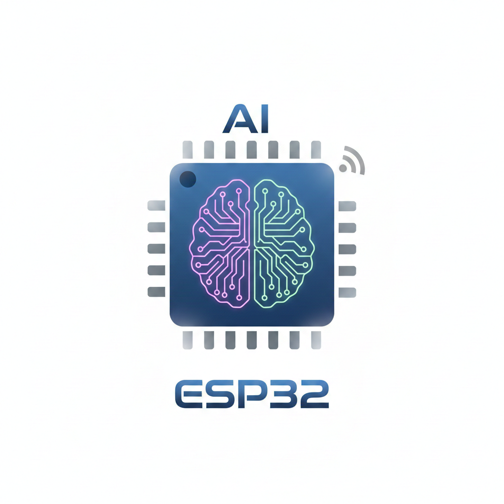

# ESP32 AI Backend

  

  
  
  

这是一个基于 **ESP32-S3** 和 **MicroPython** 开发的智能桌面桌宠。集成了语音交互、情感动作和 Web 配置中心

## ✨ 核心特性

- 🎙️ **实时交互**：通过 I2S 麦克风捕捉语音，UDP 实时流式上传后端，实现低延迟对话。
- 🎭 **表情系统**：基于 SSH1106 OLED 屏幕，拥有眨眼、思考、兴奋、失落等多种动态表情。
- 💃 **情感动作**：双舵机云台结构，根据对话内容自动触发点头、摇头、受惊等动作。
- ⚡ **降频保护**：动态频率调度逻辑，在舵机启动瞬间降频以保护电源，播放音频时升频保证算力。
- 🔊 **软音量控制**：支持 16-bit 音频采样实时缩放，无需硬件电位器即可通过网页调节音量。
- 🌐 **Web 配置中心**：自带配网模式，支持通过手机浏览器修改 WiFi、后端 IP 及各项传感器阈值。

## 🛠️ 硬件需求

- **主控**：ESP32-S3 (建议 8MB PSRAM 版本)
- **屏幕**：OLED 128x64 (I2C 接口)
- **音频输入**：INMP441 数字麦克风 (I2S)
- **音频输出**：MAX98357 功放 + 8Ω 小喇叭 (I2S)
- **舵机**：SG90/MG90S x 2
- **电源**：5V/2A 稳定供电

## 🚀 快速开始

### 1. 固件准备
确保你的 ESP32-S3 已烧录 MicroPython 固件（建议使用包含 I2S 支持的最新版本）。

### 2. 代码部署
将本仓库 `example` 文件夹下的所有 `.py` 文件上传至 ESP32 根目录：

### 3. 初始化配置
1. 上电后，寻找并连接 WiFi 热点：`Robot-Setup`。
2. 在浏览器打开 `192.168.4.1`。
3. 输入你的 WiFi 信息及后端服务器 IP 端口，点击 **Save**。
4. 点击 **Boot**，桌宠将自动连接网络并进入待机状态。

### 4. 配置后端
1. 从 Releases 页面下载对应架构的 `backend` 并运行
2. 填写 `config.json`, 其中 `api_key` 是硅基流动的API Key, `zhipu_api_key` 是智谱开放平台的 API Key
3. `prompt` 处填写 AI 预设词， `model` 填写模型
4. 确保 `8032` 端口已开放
